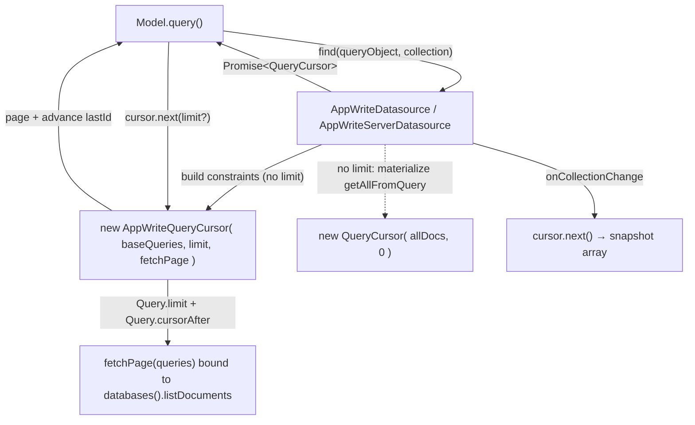
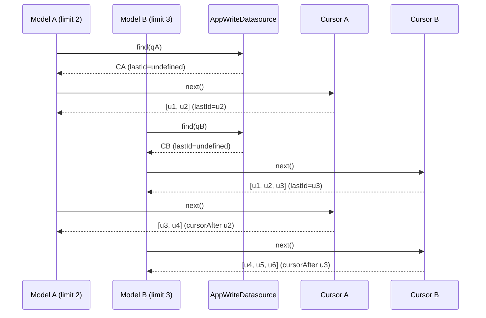

# Design — migrate AppWrite data sources to the core 2.0.0 QueryCursor API (gh-issue-3)

## Abstract

`entropic-bond` 2.0.0 moved pagination off the data source and into a `QueryCursor`
returned by `DataSource.find()`. Both AppWrite adapters still implement the old
contract (arrays + a shared `next()` built from `_last*` fields). This change
introduces one new module, `AppWriteQueryCursor`, that owns the per-query
constraint list, page size and last retrieved `$id`, and lets each adapter return
it from `find()`. Both adapters drop `next()` and all `_last*` fields. `Model`
callers (`find().get(n)` / `model.next()`) keep their public API.

## Seams

## Plan

1. Add `src/store/appwrite-query-cursor.ts` exporting `AppWriteQueryCursor extends QueryCursor`
   and the `AppWritePageFetcher` seam.
2. Migrate `AppWriteDatasource.find()` to return `Promise<QueryCursor>`; delete `next()`
   and the four `_last*` fields; make `getFromQuery()` a pure page fetch.
3. Mirror the migration in `AppWriteServerDatasource`.
4. Unwrap the cursor in `AppWriteDatasource.onCollectionChange()` before notifying.
5. Add tests: a Docker-free unit spec for the cursor (REQ-1..REQ-5) and integration
   coverage for the model interleaving (REQ-2) and snapshot (REQ-6).
6. Bump `entropic-bond` to `^2.0.0`.

## Proposed changes

- **`src/store/appwrite-query-cursor.ts`** (new)
  - `AppWritePageFetcher = ( queries: string[] ) => Promise< DocumentObject[] >`.
  - `AppWriteQueryCursor` holds `baseQueries`, `limit`, `lastDocId` and an
    `exhausted` flag; `next( limit? )` composes `Query.limit` +
    `Query.cursorAfter`, calls the fetcher, advances `lastDocId`, and returns the
    page. It reuses core's `QueryCursor` as the public type.
- **`src/store/appwrite-datasource.ts`**
  - `find()` builds constraints without a `limit(` entry (the cursor owns page
    size), returns `AppWriteQueryCursor` for bounded queries and a plain
    `QueryCursor` over the materialized `getAllFromQuery()` result otherwise.
  - `getFromQuery()` renamed to a pure `pageFromQueries()`; no `_last*` mutation.
  - `next()` and `_lastQueries` / `_lastCollectionId` / `_lastDocRetrievedId` /
    `_lastLimit` deleted.
  - `onCollectionChange()` awaits the cursor and passes `snapshot`.
- **`src/store/appwrite-server-datasource.ts`** — same migration (its
  `onCollectionChange` throws, so no snapshot to unwrap).
- **`package.json`** — `entropic-bond@^2.0.0`.
- **Tests** — `appwrite-query-cursor.spec.ts` (unit), plus interleaving cases in
  both adapter integration specs.

## Best practices

- **Depth**: the cursor hides the constraint list, page size, last `$id` and the
  fetch call behind one method, `next( limit? )`.
- **Locality**: all server-side pagination arithmetic lives in one module; both
  adapters share it instead of duplicating `_last*` bookkeeping.
- **Seam**: `find()` returns a value the caller owns, which removes shared mutable
  state from the adapters by construction (REQ-2).
- **Open/Closed for callers**: `Model.find().get()` / `model.next()` keep working;
  only the data-source seam changes.
- **Injected dependency**: the cursor receives the page fetcher, so it is testable
  without an AppWrite instance.

## Strengths

- Interleaved queries are isolated: each cursor owns its own `lastDocId`.
- Both adapters shrink (no `next()`, no shared fields) and share one cursor.
- The cursor is unit-testable with a fake fetcher, so the paging logic is covered
  even when the AppWrite emulator is unavailable.

## Weaknesses

- Breaking change for consumers that subclass the adapters or call
  `datasource.next()` directly; they must paginate via the cursor from `find()`.
- The unbounded path still materializes every document in memory
  (`getAllFromQuery`), unchanged from before; it is not lazy.
- One extra `listDocuments` round-trip is issued when the result set is exhausted
  (a short page is not treated as the end), matching the previous behaviour.

## Audit note (code-auditor)

Reviewed against `codebase-design` (feature file + `appwrite-query-cursor.ts`,
`appwrite-datasource.ts`, `appwrite-server-datasource.ts`).

- **Depth / deletion test**: `AppWriteQueryCursor` hides the constraint list, page
  size, last `$id` and the fetch call behind `next( limit? )`. Deleting it would
  scatter `Query.limit`/`Query.cursorAfter` bookkeeping and the last-id state back
  into both adapters, so it earns its keep.
- **Seam**: `find()` returns a value the caller owns, which removes shared mutable
  state by construction. The fetcher is injected, so the cursor is testable
  without an AppWrite instance.
- **Corrected during audit**: `find()`/`count()` filtered constraints with
  `query.startsWith( 'limit(' )`, but AppWrite constraints are JSON
  (`{"method":"limit",...}`), so the filter never matched and the cursor would
  have emitted two `limit` entries (its own plus the one baked into
  `buildQueryConstraints`). Both adapters now use the shared
  `AppWriteDatasource.buildPagedQueryConstraints`, covered by a unit test.

Less valuable, intentionally not changed:

- The two adapters still duplicate the `find()` branching (`buildPagedQueryConstraints`
  + `parentId` + bounded/unbounded). Extracting a shared helper would remove it,
  but both files were already near-clones and the extraction is a wider refactor
  than this migration. **Worth exploring** separately.
- `AppWriteQueryCursor extends QueryCursor` passes `[]` as the base `docs`, which
  the override never reads. Composition would avoid the unused field but would
  drop the `QueryCursor` type that `find()` must return. **Speculative**.
- `next( 0 )` would send `Query.limit( 0 )`; the old adapter kept the previous
  page size instead. No caller does this and the constructor documents
  `limit > 0`. **Speculative**.
